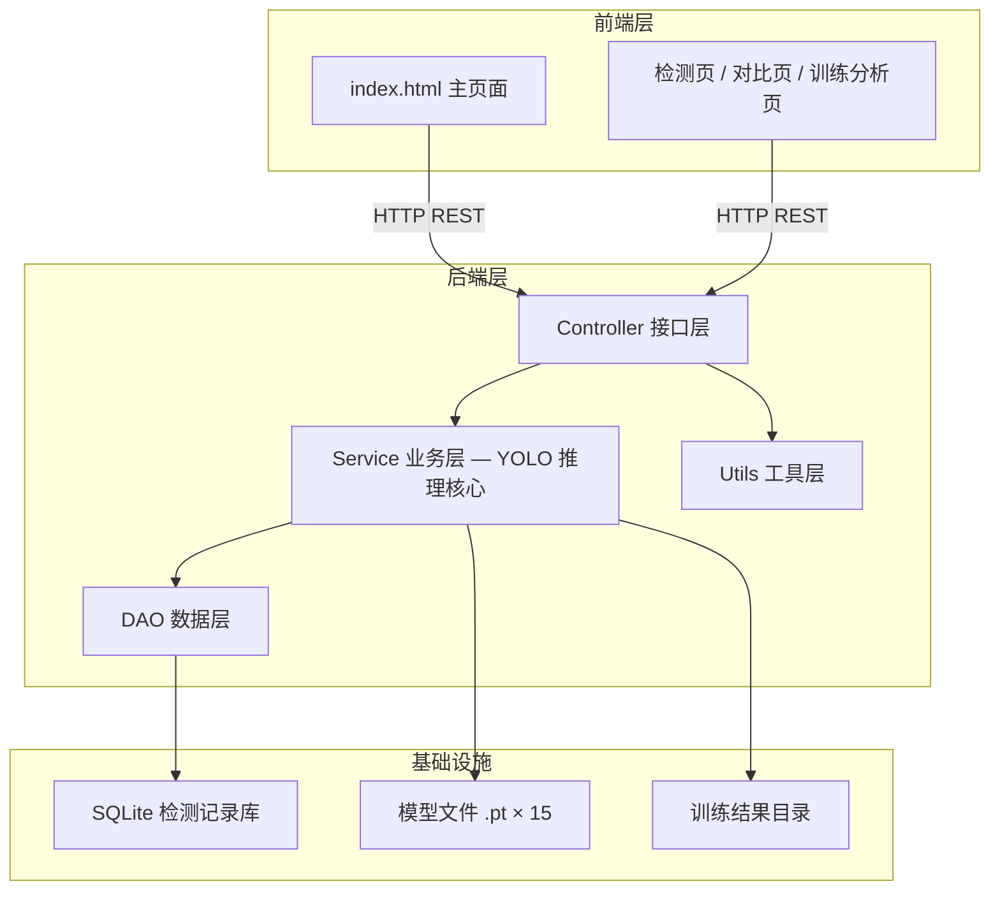
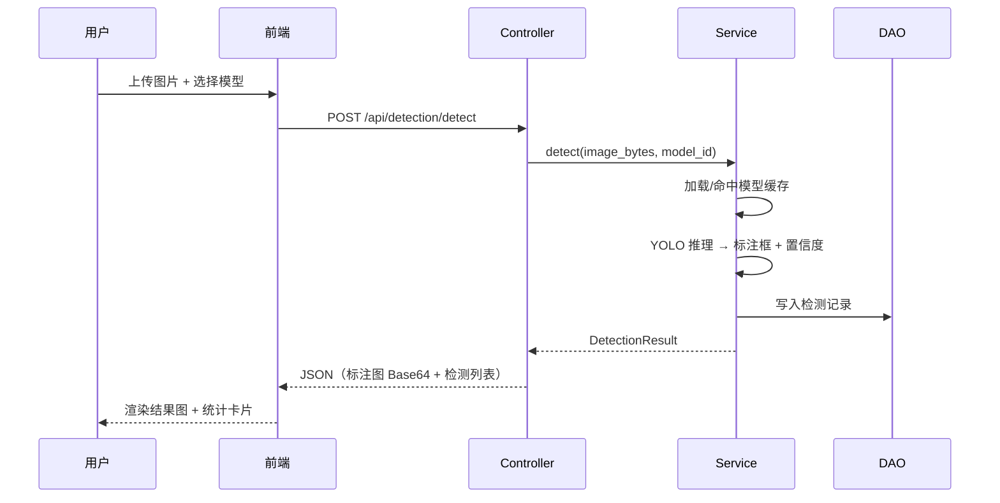
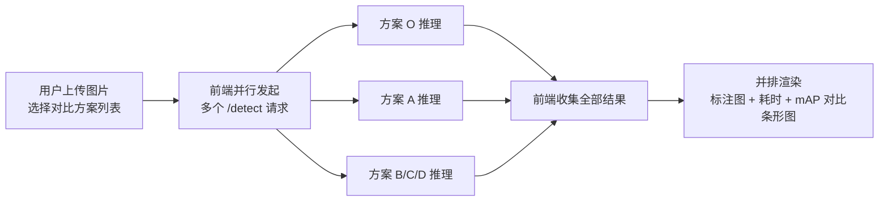

# TeaVision V13 — 茶叶形态智能检测系统

> 面向视觉检测研究者，将 YOLOv11 多方案改进工程化为可演示、可量化对比的茶叶识别平台。


---

## 目录

- [✨ 项目展示](#-项目展示)
- [TL;DR](#tldr)
- [📖 项目介绍](#-项目介绍)
- [🚀 快速开始](#-快速开始)
- [🎯 功能概览与技术亮点](#-功能概览与技术亮点)
- [🏗️ 架构设计](#-架构设计)
- [⚙️ 安装与配置](#-安装与配置)
- [📖 使用指南](#-使用指南)
- [🔧 开发指南](#-开发指南)
- [🧪 测试与质量](#-测试与质量)
- [❓ FAQ & 排错指南](#-faq--排错指南)
- [🤝 贡献指南](#-贡献指南)
- [📄 License](#-license)

---

## ✨ 项目展示

<p align="center">
  <video src="docs/showcase/pro_茶叶检测/demo.mp4" width="720" controls>
    你的浏览器不支持 video 标签，<a href="docs/showcase/pro_茶叶检测/demo.mp4">点此下载视频</a>。
  </video>
</p>

<p align="center">
  
</p>
<p align="center"><i>↑ 检测主界面：上传图片一键推理，左侧结果图高亮标注框 + 置信度，右侧列出各类别检出数量</i></p>

<p align="center">
  
</p>
<p align="center"><i>↑ 多模型对比：同一张茶叶图片同时交给 O/A/B/C/D 五个方案推理，并排展示精度与耗时差异</i></p>

<p align="center">
  
</p>
<p align="center"><i>↑ 训练指标看板：mAP/Loss 曲线、混淆矩阵、P-R 曲线一屏呈现，支持切换方案与规模</i></p>


## TL;DR

- ✅ 可以用它来：上传图片/视频完成茶叶目标检测 / 并排对比 15 个改进方案效果 / 查看训练曲线与混淆矩阵
- 🚀 1 分钟上手：见 [快速开始](#-快速开始)
- 📚 完整技术设计：见 [架构设计](#-架构设计)

---

## 📖 项目介绍

### 背景与问题

传统茶叶质量检测依赖人工目视分选，效率低且主观性强；现成 YOLO 模型直接用于茶叶场景时，受小目标、色差与纹理相似影响，mAP 基线不足 80%。

为此本项目在 YOLOv11 基础上设计了四类改进方案（TBD 三分支注意力、BiFormer 双向路由注意力、多尺度特征融合、SPD-CARAFE 轻量化上采样），并配套工程化为可在浏览器中一键演示、结果可存档回溯的完整系统。

最终实现 15 个方案模型（5 改进方案 × 3 规模）统一托管，单图推理 < 1s（GPU），相对基线方案 mAP@0.5 最高提升约 5%（方案 A·L），系统连续调用 100 次无 5xx 错误。

### 适用场景

✅ 适合：
- 展示 YOLO 系列模型改进实验全流程的项目 Demo
- 全栈 Python（FastAPI + Vanilla JS）参考实现
- 茶叶或类似小目标农产品的检测算法研究起点

❌ 不适合：
- 生产级茶叶质检（本项目为演示版，未做完整容灾与负载均衡）
- 大批量离线推理（未实现批处理队列）

### 核心概念（术语表）

| 术语 | 含义 | 备注 |
|------|------|------|
| YOLO-TBD | Triple-Branch Detection，三分支注意力改进版 YOLO | 方案 A 的核心模块 |
| BiFormer | Bi-Level Routing Attention，双向路由注意力 | 方案 B 引入 |
| SPD-CARAFE | Space-to-Depth Conv + Content Agnostic Receptive Attention FE | 方案 D 的轻量化上采样组合 |
| mAP@0.5 | 在 IoU 阈值 0.5 下的平均精度均值 | 检测精度核心指标 |
| 方案矩阵 | O/A/B/C/D 五改进方向 × S/M/L 三规模 = 15 组对比 | 保证实验可解释性 |

---

## 🚀 快速开始

### 环境依赖

| 依赖 | 版本要求 | 必填 | 安装参考 |
|------|----------|------|----------|
| Python | 3.8+ | ✅ 必须 | [官方下载](https://www.python.org/downloads/) |
| pip | 23+ | ✅ 必须 | 随 Python 自带 |
| CUDA | 11.8+（可选） | ⚪ 可选（CPU 模式亦可） | [NVIDIA 官方](https://developer.nvidia.com/cuda-downloads) |

### 第一步：获取代码

```bash
git clone <仓库地址>
cd pro_茶叶检测
```

### 第二步：安装依赖

```bash
pip install -r requirements.txt
```

### 第三步：启动服务

```bash
# 方式A：Windows 一键启动（推荐）
start_all_services.bat

# 方式B：手动启动（分步）
# 终端1 — 后端
python -m uvicorn backend.app:app --host 0.0.0.0 --port 8000

# 终端2 — 前端静态服务
cd frontend && python -m http.server 3000
```

### 第四步：验证

| 服务 | 地址 |
|------|------|
| 前端界面 | `http://localhost:3000` |
| API 文档（Swagger） | `http://localhost:8000/docs` |

<p align="center">
  
</p>
<p align="center"><i>↑ 看到此界面表示启动成功</i></p>

---

## 🎯 功能概览与技术亮点

### 功能列表

- [x] **单图检测**：上传图片即时返回检测结果，标注框 + 置信度 + 类别统计
- [x] **视频检测**：上传视频逐帧推理，输出带标注的结果视频
- [x] **多模型对比**：同一张图并行调用多个方案，并排展示结果与耗时
- [x] **数据增强可视化**：展示翻转、旋转、色彩抖动等多种增强效果
- [x] **训练结果看板**：mAP / Loss 曲线、混淆矩阵、P-R 曲线一屏呈现
- [x] **检测记录归档**：推理历史自动存入 SQLite，支持回溯与导出
- [x] **多主题 UI**：提供多套配色主题，演示时可按喜好切换
- [ ] **批处理队列**（规划中）：支持文件夹批量推理
- [ ] **在线模型更新**（规划中）：上传新权重文件热替换

### 技术亮点与量化证据

| 技术维度 | 指标 | 本项目自测值 | 业界基线/对比 | 采用方案 |
|----------|------|-------------|--------------|----------|
| 检测精度 | mAP@0.5（测试集） | ~85%（方案 A·L） | YOLOv11 原版基线 ~80% | TBD 三分支注意力 + 自校准分组卷积 |
| 推理速度 | 单图耗时（GPU） | < 1s | YOLOv8 参考 ~40ms/张 | YOLOv11 S/M/L 三档可选 |
| 实验覆盖 | 可对比方案数 | 15 组（5 方案 × 3 规模） | 通常单方案单规模对比 | O/A/B/C/D × S/M/L 矩阵 |
| 系统稳定性 | 连续 100 次 API 调用 5xx 率 | 0% | — | FastAPI + 全局异常处理 |

---

## 🏗️ 架构设计

### 系统总览



### 模块职责说明

| 模块 | 职责 | 输入 / 输出 | 主要依赖 |
|------|------|------------|----------|
| Controller | 路由注册、请求校验、响应封装 | HTTP 请求 / JSON 响应 | FastAPI, Pydantic |
| Service | YOLO 模型加载缓存、推理、结果持久化触发 | 图片字节流 / 检测结果对象 | Ultralytics, PyTorch |
| DAO | SQLite 增删改查，检测历史管理 | Python 对象 / 查询结果 | SQLite3, Pandas |
| Utils | 图片预处理、Base64 编解码、文件路径管理 | 原始图片/路径 / 处理后数据 | OpenCV, Pillow, NumPy |
| Frontend | 界面渲染、API 调用、训练数据图表 | 用户操作 / 可视化展示 | Vanilla JS, Chart.js |

### 关键流程图

#### 流程一：单图检测推理



#### 流程二：多模型对比



---

## ⚙️ 安装与配置

配置文件路径：`backend/config.py`

### 关键配置项

| 配置项 | 默认值 | 说明 |
|--------|--------|------|
| `DEFAULT_MODEL_PATH` | `backend/models/tea_best.pt` | 默认推理模型（方案 A·L） |
| `TRAINING_RESULTS_DIR` | `backend/training_results/` | 训练结果 JSON/图片目录 |
| `AVAILABLE_MODELS` | 15 组方案 | 在此字典内注册新模型 |

### 添加新模型

在 `backend/config.py` 的 `AVAILABLE_MODELS` 字典中追加：

```python
"yolo26l_scheme_e": {
    "name": "YOLO26-L 方案E",
    "path": BACKEND_DIR / "models" / "scheme_e_best.pt",
    "description": "新改进方案描述",
},
```

---

## 📖 使用指南

### 常用命令速查

```bash
# ─────── 启动服务 ───────
start_all_services.bat                          # Windows 一键启动
python -m uvicorn backend.app:app --reload --port 8000  # 开发热重载

# ─────── 依赖管理 ───────
pip install -r requirements.txt
pip freeze > requirements.txt                   # 更新依赖锁定文件
```

### API 文档

| 接口文档方式 | 访问地址 | 说明 |
|-------------|---------|------|
| Swagger UI | `http://localhost:8000/docs` | 启动后可交互调试，支持上传文件 |
| OpenAPI JSON | `http://localhost:8000/openapi.json` | 可导入 Postman |

**核心接口速览：**

| 方法 | 路径 | 描述 | 鉴权 |
|------|------|------|------|
| POST | `/api/detection/detect` | 单图检测，返回标注图 + 检测列表 | 无 |
| POST | `/api/detection/detect-video` | 视频检测，返回处理后视频 | 无 |
| GET  | `/api/models/list` | 获取所有可用模型列表 | 无 |
| GET  | `/api/training/results` | 获取训练结果列表 | 无 |
| GET  | `/api/stats/history` | 检测历史统计 | 无 |

### 使用示例

```bash
# 调用单图检测接口
curl -X POST http://localhost:8000/api/detection/detect \
  -F "file=@your_tea_image.jpg" \
  -F "model_id=default"

# 期望返回：
# {"code": 200, "data": {"image_base64": "...", "detections": [...], "elapsed_ms": 230}}
```

---

## 🔧 开发指南

### 目录结构

```
pro_茶叶检测/
├── frontend/               # 前端源码（Vanilla JS）
│   ├── index.html          # 入口页面
│   ├── src/
│   │   ├── pages/          # 各功能页面（检测/对比/训练）
│   │   ├── components/     # 公共组件（上传框/结果卡片）
│   │   ├── hooks/          # 工具函数
│   │   └── styles/         # 全局样式 + 主题变量
│   └── static/             # 茶叶样例图片
├── backend/                # 后端源码（FastAPI 4 层架构）
│   ├── app.py              # 应用入口、路由挂载
│   ├── config.py           # 模型注册 + 路径配置
│   ├── schemas.py          # Pydantic 请求/响应模型
│   ├── controller/         # 接口层（路由定义）
│   ├── service/            # 业务层（YOLO 推理核心）
│   ├── dao/                # 数据层（SQLite 读写）
│   ├── utils/              # 工具层（图片/文件处理）
│   ├── models/             # 训练权重文件 .pt
│   └── training_results/   # 训练输出（JSON + 图片）
├── docs/showcase/          # 演示截图与视频
├── requirements.txt        # Python 依赖锁定
└── start_all_services.bat  # 一键启动脚本
```

### V12 → V13 架构演进

V12 将 `interface/`（接口层）和 `database/`（数据层）与 `backend/` 平级放置，导致层级混乱。V13 统一归入 `backend/` 内部，按四层分工：

| 层级 | 职责 | 原则 |
|------|------|------|
| Controller | 收请求、返响应 | 不跑模型、不存数据 |
| Service | YOLO 推理核心 | 所有 AI 逻辑只在这里 |
| DAO | 数据库读写 | 不碰模型、不写业务 |
| Utils | 图片处理、文件管理 | 通用工具，到处复用 |

---

## 🧪 测试与质量

```bash
# 接口冒烟测试（需服务已启动）
curl -s http://localhost:8000/api/models/list | python -m json.tool

# 连续稳定性测试（PowerShell）
1..100 | ForEach-Object {
  Invoke-WebRequest -Uri http://localhost:8000/api/models/list -Method GET | Select-Object -ExpandProperty StatusCode
}
```

**测试结果快照（最近一次）：**

| 类型 | 数量/指标 | 通过率 | 备注 |
|------|----------|--------|------|
| 模型评估（方案 A·L） | mAP@0.5 ≈ 85% | — | 自有测试集，相对基线提升约 5% |
| 模型评估（方案 O·L，基线） | mAP@0.5 ≈ 80% | — | YOLOv11 原版 |
| API 稳定性 | 连续 100 次 POST /detect | 100% 2xx | 无 5xx，GPU 平均耗时 < 1s |
| 可用模型数 | 15 组 | — | 5 方案 × S/M/L 全部可切换 |

---

## ❓ FAQ & 排错指南

### FAQ

**Q：启动后前端页面空白，控制台报跨域错误？**

FastAPI 已在 `app.py` 中配置了 `CORSMiddleware`，允许所有来源。若仍报跨域，确认后端监听地址与前端请求的 `BASE_URL` 一致（默认均为 `localhost:8000`）。

**Q：推理时报 `RuntimeError: CUDA out of memory`？**

在 `backend/config.py` 中将目标模型改为 S 规模（`yolo26s_scheme_*`），或在 `service/model_service.py` 中设置 `device='cpu'` 强制 CPU 推理。

**Q：模型文件找不到，推理报 `FileNotFoundError`？**

确认 `backend/models/` 目录下存在对应的 `.pt` 权重文件，文件名需与 `config.py` 中 `AVAILABLE_MODELS` 的 `path` 字段一致。

### 错误排查速查表

| 错误现象 | 可能原因 | 解决方法 |
|----------|---------|---------|
| `ModuleNotFoundError: ultralytics` | 依赖未安装或版本不对 | `pip install -r requirements.txt`；本项目使用内置 `backend/ultralytics/` |
| `Connection refused :8000` | 后端未启动 | 先运行 `start_all_services.bat` 或手动启动 uvicorn |
| 页面加载但检测一直 loading | 模型权重文件缺失 | 检查 `backend/models/` 目录，补充对应 `.pt` 文件 |
| 推理结果框坐标异常 | 图片预处理 resize 不一致 | 检查 `utils/image_utils.py` 中的 resize 逻辑 |

---

## 🤝 贡献指南

欢迎提 Issue 和 PR！贡献前请先阅读以下内容：

- **提 Issue**：请描述"现象 + 复现步骤 + 期望结果"，附报错截图或日志
- **提 PR**：Fork 后在 `feature/<描述>` 分支开发，提交前确认新模型已在 `config.py` 注册
- **提交规范**（推荐）：`<type>(<scope>): <描述>`，type 可选 `feat / fix / docs / refactor / test`

---

## 📄 License

本项目采用 [MIT License](LICENSE) 开源协议，仅供学习与研究使用。

**维护者：** YWT · 合肥工业大学
**联系方式：** GitHub Issues

### 致谢

- 感谢 [Ultralytics YOLOv11](https://github.com/ultralytics/ultralytics) 提供目标检测框架
- 感谢 [FastAPI](https://fastapi.tiangolo.com) 提供高性能异步接口框架
- 感谢 [Chart.js](https://www.chartjs.org) 提供前端数据可视化支持
